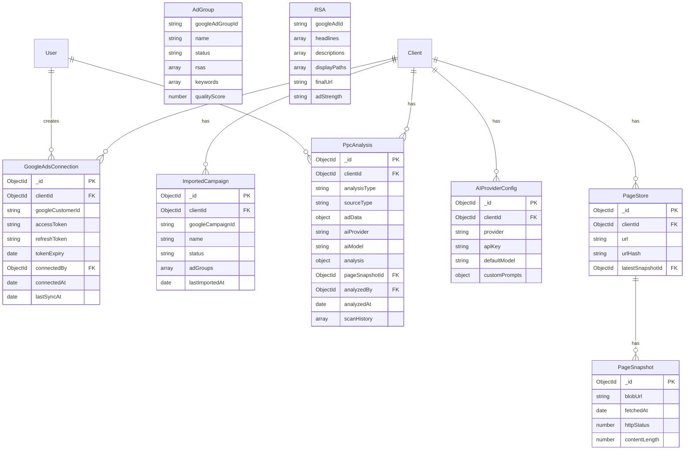

# PPC Page Analyser v2 - Technical Specification

> **Version:** 1.0.0
> **Status:** Draft for Review
> **Created:** 2026-01-25
> **Author:** Claude Code

---

## Table of Contents

1. [Executive Summary](#executive-summary)
2. [Problem Statement](#problem-statement)
3. [Solution Overview](#solution-overview)
4. [User Experience Flow](#user-experience-flow)
5. [Data Architecture](#data-architecture)
6. [Technical Implementation](#technical-implementation)
7. [API Integrations](#api-integrations)
8. [AI Analysis Engine](#ai-analysis-engine)
9. [Database Models](#database-models)
10. [File Structure](#file-structure)
11. [Environment Configuration](#environment-configuration)
12. [Implementation Phases](#implementation-phases)
13. [Future Enhancements](#future-enhancements)

---

## Executive Summary

The PPC Page Analyser v2 is an AI-powered tool that bridges the gap between Google Ads and landing page optimisation. It imports ad data directly from Google Ads API, analyses the relationship between ad copy and landing page content using AI (Claude or OpenAI), and provides actionable recommendations to improve Quality Score and conversion rates.

### Key Features

- **Google Ads API Integration** - Import campaigns, ad groups, RSAs, keywords, and Quality Scores
- **Dual AI Support** - Choose between Claude (Anthropic) or OpenAI for analysis
- **Flexible Analysis Scope** - Analyse single ads or entire ad groups against landing pages
- **Message Match Detection** - AI identifies mismatches between ad promises and page content
- **Actionable Recommendations** - Priority-ranked fixes with estimated impact
- **Historical Tracking** - Monitor improvements over time, correlate with QS changes

---

## Problem Statement

### What Google/Microsoft Provide

| They Do | They Don't Do |
|---------|---------------|
| Quality Score (1-10) | Explain *why* it's low specifically |
| Landing Page Experience rating | Show which elements cause poor ratings |
| Ad Strength indicator | Connect ad copy to page elements |
| Generic recommendations | Provide specific rewrite suggestions |

### The Gap We Fill

Google tells you: *"Landing Page Experience: Below Average"*

We tell you: *"Your Headline 3 promises 'Free Next-Day Delivery' but this isn't mentioned anywhere on your landing page. Add a delivery badge above the fold to improve message match."*

---

## Solution Overview


---

## User Experience Flow

### Complete UX Journey


### Screen-by-Screen Flow


---

## Data Architecture

### Data Flow Diagram

```mermaid
flowchart TB
    subgraph External["External Systems"]
        GAds[Google Ads API]
        Claude[Claude API]
        OpenAI[OpenAI API]
    end

    subgraph TDSPortal["TDS App Portal"]
        subgraph Services["Service Layer"]
            GAS[Google Ads Service]
            AIS[AI Analysis Service]
            PSS[Page Store Service]
        end

        subgraph API["API Routes"]
            AuthAPI[/api/integrations/google-ads/auth]
            ImportAPI[/api/integrations/google-ads/import]
            AnalyzeAPI[/api/tools/ppc-page-analyser/analyze]
            SavedAPI[/api/tools/ppc-page-analyser/saved]
        end

        subgraph Database["MongoDB Collections"]
            GAC[(GoogleAdsConnection)]
            IC[(ImportedCampaign)]
            PA[(PpcAnalysis)]
            PS[(PageStore)]
            PSN[(PageSnapshot)]
            APC[(AIProviderConfig)]
        end

        subgraph Blob["Vercel Blob"]
            HTML[Page HTML Storage]
        end
    end

    GAds <-->|OAuth + Data| GAS
    Claude <-->|Analysis| AIS
    OpenAI <-->|Analysis| AIS

    GAS --> AuthAPI
    GAS --> ImportAPI
    AIS --> AnalyzeAPI
    PSS --> AnalyzeAPI

    AuthAPI --> GAC
    ImportAPI --> IC
    AnalyzeAPI --> PA
    PSS --> PS
    PSS --> PSN
    PSS --> HTML

    SavedAPI --> PA
```

### Entity Relationship Diagram



---

## Technical Implementation

### Authentication Flow for Google Ads


### Analysis Flow


---

## API Integrations

### Google Ads API

#### Required OAuth Scopes

```
https://www.googleapis.com/auth/adwords
```

#### Key Endpoints Used

| Endpoint | Purpose |
|----------|---------|
| `GET /customers` | List accessible customer accounts |
| `GET /customers/{id}/campaigns` | List campaigns |
| `GET /customers/{id}/adGroups` | List ad groups |
| `GET /customers/{id}/ads` | Get RSA details |
| `GET /customers/{id}/adGroupCriteria` | Get keywords |
| `GET /customers/{id}/adGroupAdAssetView` | Get asset performance |

#### Data We Import

```typescript
interface ImportedAdGroup {
  googleAdGroupId: string;
  name: string;
  status: 'ENABLED' | 'PAUSED' | 'REMOVED';
  rsas: {
    googleAdId: string;
    headlines: {
      text: string;
      pinnedPosition?: 1 | 2 | 3;
    }[];
    descriptions: {
      text: string;
      pinnedPosition?: 1 | 2;
    }[];
    displayPaths: [string, string];
    finalUrl: string;
    adStrength: 'EXCELLENT' | 'GOOD' | 'AVERAGE' | 'POOR' | 'UNSPECIFIED';
  }[];
  keywords: {
    text: string;
    matchType: 'EXACT' | 'PHRASE' | 'BROAD';
  }[];
  qualityScore?: number;
  landingPageExperience?: 'ABOVE_AVERAGE' | 'AVERAGE' | 'BELOW_AVERAGE';
  adRelevance?: 'ABOVE_AVERAGE' | 'AVERAGE' | 'BELOW_AVERAGE';
  expectedCtr?: 'ABOVE_AVERAGE' | 'AVERAGE' | 'BELOW_AVERAGE';
}
```

### AI Provider APIs

#### Claude (Anthropic)

```typescript
// Model options
const CLAUDE_MODELS = [
  'claude-sonnet-4-20250514',    // Fast, cost-effective
  'claude-opus-4-20250514',      // Most capable
] as const;

// API endpoint
POST https://api.anthropic.com/v1/messages
```

#### OpenAI

```typescript
// Model options
const OPENAI_MODELS = [
  'gpt-4o',           // Latest, most capable
  'gpt-4o-mini',      // Faster, cheaper
] as const;

// API endpoint
POST https://api.openai.com/v1/chat/completions
```

---

## AI Analysis Engine

### Analysis Framework

The AI analyses the ad-to-page relationship across six categories:


### Category Definitions

| Category | Weight | What AI Evaluates |
|----------|--------|-------------------|
| **Message Match** | 25% | Do ad headlines appear on page? Is the offer consistent? Keywords present? |
| **Ad Scent** | 20% | Visual consistency, CTA alignment, emotional tone continuity |
| **Conversion Elements** | 20% | CTA visibility, form friction, above-fold content, click path |
| **Technical Quality** | 15% | Mobile responsiveness, page structure, Core Web Vitals indicators |
| **Content Relevance** | 10% | Keyword density, semantic relevance, topic alignment |
| **Trust & Credibility** | 10% | Social proof, testimonials, security badges, contact info |

### Prompt Structure

```typescript
interface AnalysisPrompt {
  systemPrompt: string;      // Role and framework definition
  adData: {
    headlines: string[];
    descriptions: string[];
    keywords: string[];
    finalUrl: string;
    qualityScore?: number;
  };
  pageContent: {
    html: string;
    textContent: string;
    url: string;
  };
  analysisInstructions: string;  // Category-specific guidance
  outputSchema: object;          // Expected JSON structure
}
```

### Expected AI Output

```typescript
interface AIAnalysisResult {
  overallScore: number;  // 0-100

  categoryScores: {
    messageMatch: number;
    adScent: number;
    conversionElements: number;
    technicalQuality: number;
    contentRelevance: number;
    trustCredibility: number;
  };

  issues: {
    severity: 'critical' | 'warning' | 'suggestion';
    category: string;
    element: string;        // e.g., "Headline 3"
    problem: string;        // What's wrong
    location?: string;      // Where on page (if applicable)
    impact: string;         // Why it matters
  }[];

  recommendations: {
    priority: 1 | 2 | 3;    // 1 = highest
    category: string;
    action: string;         // What to do
    currentState: string;   // What exists now
    suggestedChange: string; // Specific new copy/element
    estimatedImpact: string; // Expected improvement
  }[];

  messageMatchMap: {
    adElement: string;      // e.g., "Headline 2: Free Shipping"
    pageElement?: string;   // e.g., "Banner text: Free shipping on orders over £50"
    matchStrength: 'strong' | 'partial' | 'none';
    notes?: string;
  }[];

  summary: {
    strengths: string[];
    weaknesses: string[];
    quickWins: string[];    // Easy fixes with high impact
  };
}
```

---

## Database Models

### GoogleAdsConnection

```typescript
// packages/database/src/models/google-ads-connection.ts

interface IGoogleAdsConnection extends Document {
  _id: ObjectId;
  clientId: ObjectId;              // TDS Client reference
  googleCustomerId: string;        // xxx-xxx-xxxx format
  googleAccountName: string;       // Display name
  accessToken: string;             // Encrypted
  refreshToken: string;            // Encrypted
  tokenExpiry: Date;
  scopes: string[];
  connectedBy: ObjectId;           // User who connected
  connectedAt: Date;
  lastSyncAt?: Date;
  syncStatus: 'idle' | 'syncing' | 'error';
  lastError?: string;
  createdAt: Date;
  updatedAt: Date;
}
```

### ImportedCampaign

```typescript
// packages/database/src/models/imported-campaign.ts

interface IImportedCampaign extends Document {
  _id: ObjectId;
  clientId: ObjectId;
  connectionId: ObjectId;          // GoogleAdsConnection reference
  googleCampaignId: string;
  name: string;
  status: 'ENABLED' | 'PAUSED' | 'REMOVED';
  campaignType: string;

  adGroups: {
    googleAdGroupId: string;
    name: string;
    status: 'ENABLED' | 'PAUSED' | 'REMOVED';

    rsas: {
      googleAdId: string;
      headlines: {
        text: string;
        pinnedPosition?: 1 | 2 | 3;
        assetPerformance?: string;
      }[];
      descriptions: {
        text: string;
        pinnedPosition?: 1 | 2;
        assetPerformance?: string;
      }[];
      displayPaths: [string, string];
      finalUrl: string;
      adStrength: string;
      status: string;
    }[];

    keywords: {
      googleKeywordId: string;
      text: string;
      matchType: 'EXACT' | 'PHRASE' | 'BROAD';
      status: string;
      qualityScore?: number;
    }[];

    // Quality metrics at ad group level
    qualityScore?: number;
    landingPageExperience?: string;
    adRelevance?: string;
    expectedCtr?: string;
  }[];

  lastImportedAt: Date;
  importedBy: ObjectId;
  createdAt: Date;
  updatedAt: Date;
}
```

### PpcAnalysis (Updated)

```typescript
// packages/database/src/models/ppc-analysis.ts

interface IPpcAnalysis extends Document {
  _id: ObjectId;
  clientId: ObjectId;

  // Analysis scope
  analysisType: 'single_ad' | 'ad_group';
  sourceType: 'google_import' | 'microsoft_import' | 'manual_entry';

  // Source references (if imported)
  importedCampaignId?: ObjectId;
  googleAdGroupId?: string;
  googleAdId?: string;

  // Ad data (denormalized for history)
  adData: {
    headlines: {
      text: string;
      pinnedPosition?: number;
    }[];
    descriptions: {
      text: string;
      pinnedPosition?: number;
    }[];
    displayPaths?: [string, string];
    keywords: {
      text: string;
      matchType: string;
    }[];
    finalUrl: string;

    // From Google at time of analysis
    qualityScore?: number;
    landingPageExperience?: string;
    adRelevance?: string;
    expectedCtr?: string;
    adStrength?: string;
  };

  // AI configuration used
  aiProvider: 'claude' | 'openai';
  aiModel: string;
  analysisFocus?: 'ecommerce' | 'leadgen' | 'b2b' | 'custom';
  customPromptId?: ObjectId;

  // Analysis results
  analysis: {
    overallScore: number;
    categoryScores: {
      messageMatch: number;
      adScent: number;
      conversionElements: number;
      technicalQuality: number;
      contentRelevance: number;
      trustCredibility: number;
    };
    issues: {
      severity: string;
      category: string;
      element: string;
      problem: string;
      location?: string;
      impact: string;
    }[];
    recommendations: {
      priority: number;
      category: string;
      action: string;
      currentState: string;
      suggestedChange: string;
      estimatedImpact: string;
    }[];
    messageMatchMap: {
      adElement: string;
      pageElement?: string;
      matchStrength: string;
      notes?: string;
    }[];
    summary: {
      strengths: string[];
      weaknesses: string[];
      quickWins: string[];
    };
  };

  // Page Store integration
  pageSnapshotId: ObjectId;
  pageUrl: string;

  // Tracking
  analyzedBy: ObjectId;
  analyzedAt: Date;
  analysisTimeMs: number;          // How long AI took

  // History
  scanHistory: {
    scannedAt: Date;
    scannedBy: ObjectId;
    score: number;
    categoryScores: object;
    changesDetected: boolean;
    pageSnapshotId: ObjectId;
    googleQualityScore?: number;   // QS at time of scan
    snapshot: object;              // Full analysis snapshot
  }[];
  scanCount: number;
  lastScannedAt: Date;
  lastScannedBy: ObjectId;

  createdAt: Date;
  updatedAt: Date;
}
```

### AIProviderConfig

```typescript
// packages/database/src/models/ai-provider-config.ts

interface IAIProviderConfig extends Document {
  _id: ObjectId;
  clientId?: ObjectId;             // null = global default

  provider: 'claude' | 'openai';
  apiKey: string;                  // Encrypted
  defaultModel: string;

  // Rate limiting
  requestsPerMinute?: number;
  tokensPerDay?: number;

  // Custom prompts
  customPrompts?: {
    name: string;
    description: string;
    systemPrompt: string;
    analysisInstructions: string;
    focus: string;
    isDefault: boolean;
  }[];

  createdBy: ObjectId;
  createdAt: Date;
  updatedAt: Date;
}
```

---

## File Structure

```
apps/portal/
├── lib/
│   ├── services/
│   │   ├── google-ads-service.ts       # Google Ads API wrapper
│   │   ├── ai-analysis-service.ts      # Claude + OpenAI unified interface
│   │   ├── encryption-service.ts       # Token encryption/decryption
│   │   └── page-store-service.ts       # Existing
│   │
│   ├── google-ads/
│   │   ├── client.ts                   # API client setup
│   │   ├── types.ts                    # Google Ads type definitions
│   │   └── queries.ts                  # GAQL queries
│   │
│   └── ai/
│       ├── prompts/
│       │   ├── base-analysis.ts        # Core analysis prompt
│       │   ├── ecommerce-focus.ts      # E-commerce specific
│       │   ├── leadgen-focus.ts        # Lead gen specific
│       │   └── b2b-focus.ts            # B2B specific
│       ├── claude-client.ts            # Claude API wrapper
│       ├── openai-client.ts            # OpenAI API wrapper
│       └── output-parser.ts            # Parse AI responses
│
├── app/
│   ├── api/
│   │   ├── integrations/
│   │   │   └── google-ads/
│   │   │       ├── connect/route.ts    # Initiate OAuth
│   │   │       ├── callback/route.ts   # OAuth callback
│   │   │       ├── disconnect/route.ts # Remove connection
│   │   │       ├── accounts/route.ts   # List available accounts
│   │   │       ├── campaigns/route.ts  # List campaigns
│   │   │       └── import/route.ts     # Import campaigns/ad groups
│   │   │
│   │   ├── ai-config/
│   │   │   └── route.ts                # Manage AI provider settings
│   │   │
│   │   └── tools/
│   │       └── ppc-page-analyser/
│   │           ├── analyze/route.ts    # Run AI analysis
│   │           ├── saved/route.ts      # CRUD operations
│   │           ├── saved/[id]/
│   │           │   ├── route.ts        # Single analysis ops
│   │           │   └── rescan/route.ts # Re-run analysis
│   │           ├── batch/route.ts      # Batch history
│   │           └── export/route.ts     # Export reports
│   │
│   ├── settings/
│   │   └── integrations/
│   │       └── page.tsx                # Integrations settings page
│   │
│   └── tools/
│       └── ppc-page-analyser/
│           ├── page.tsx                # Main tool page
│           ├── layout.tsx              # Tool layout
│           │
│           └── components/
│               ├── ConnectionStatus.tsx
│               ├── GoogleAdsImporter.tsx
│               ├── CampaignTree.tsx
│               ├── AdGroupSelector.tsx
│               ├── ManualAdEntry.tsx
│               ├── HeadlineInput.tsx
│               ├── DescriptionInput.tsx
│               ├── KeywordInput.tsx
│               ├── AIProviderSelector.tsx
│               ├── AnalysisFocusSelector.tsx
│               ├── AnalysisRunner.tsx
│               ├── AnalysisReport.tsx
│               ├── ScoreDashboard.tsx
│               ├── CategoryBreakdown.tsx
│               ├── IssuesList.tsx
│               ├── RecommendationsList.tsx
│               ├── MessageMatchVisualizer.tsx
│               ├── HistoryTimeline.tsx
│               ├── ExportOptions.tsx
│               └── types.ts

packages/database/src/
├── models/
│   ├── google-ads-connection.ts
│   ├── imported-campaign.ts
│   ├── ppc-analysis.ts                 # Updated
│   ├── ai-provider-config.ts
│   └── index.ts                        # Export all
│
└── index.ts                            # Package exports
```

---

## Environment Configuration

### Required Environment Variables

```bash
# ===== Existing =====
MONGODB_URI=mongodb+srv://...
NEXTAUTH_URL=http://localhost:3000
NEXTAUTH_SECRET=your-secret-key
GOOGLE_CLIENT_ID=oauth-client-id
GOOGLE_CLIENT_SECRET=oauth-client-secret

# ===== New: Google Ads API =====
# Get from Google Ads API Center
GOOGLE_ADS_DEVELOPER_TOKEN=your-developer-token

# OAuth for Google Ads (can reuse existing Google OAuth app)
# Add these scopes: https://www.googleapis.com/auth/adwords
GOOGLE_ADS_CLIENT_ID=oauth-client-id
GOOGLE_ADS_CLIENT_SECRET=oauth-client-secret

# ===== New: AI Providers =====
# Anthropic (Claude)
ANTHROPIC_API_KEY=sk-ant-api03-...

# OpenAI
OPENAI_API_KEY=sk-proj-...

# ===== New: Security =====
# For encrypting stored tokens (generate with: openssl rand -hex 32)
ENCRYPTION_KEY=64-character-hex-string
```

### Google Cloud Console Setup

1. **Enable APIs:**
   - Google Ads API
   - Google OAuth 2.0

2. **OAuth Consent Screen:**
   - Add scope: `https://www.googleapis.com/auth/adwords`
   - Add authorized redirect URI: `https://your-domain.com/api/integrations/google-ads/callback`

3. **Google Ads API Center:**
   - Apply for developer token
   - Set API access level (Basic or Standard)

---

## Implementation Phases


### Phase 1: Foundation (Days 1-2)
- [ ] Create database models (GoogleAdsConnection, ImportedCampaign, updated PpcAnalysis, AIProviderConfig)
- [ ] Build encryption service for secure token storage
- [ ] Set up environment variables
- [ ] Export models from @tds/database package

### Phase 2: Google Ads Integration (Days 3-6)
- [ ] Build Google Ads OAuth flow (connect, callback, disconnect)
- [ ] Create Google Ads API service wrapper
- [ ] Implement campaign/ad group listing endpoints
- [ ] Build import functionality (fetch and store RSAs, keywords)
- [ ] Create Import UI (campaign tree, selection, progress)

### Phase 3: AI Analysis Engine (Days 7-11)
- [ ] Build Claude API client
- [ ] Build OpenAI API client
- [ ] Create unified AI service interface
- [ ] Write analysis prompts (base + focus variants)
- [ ] Build output parser for AI responses
- [ ] Create AI provider configuration UI

### Phase 4: Analysis UI (Days 12-16)
- [ ] Build Analysis Runner component
- [ ] Create Score Dashboard
- [ ] Build Category Breakdown visualisation
- [ ] Create Issues List with severity indicators
- [ ] Build Recommendations List with priority sorting
- [ ] Create Message Match Visualizer
- [ ] Implement History Timeline
- [ ] Add Export options (PDF, CSV, JSON)

### Phase 5: Polish (Days 17-19)
- [ ] End-to-end testing
- [ ] Error handling improvements
- [ ] Performance optimisation
- [ ] Documentation updates

---

## Future Enhancements

### Phase 6: Microsoft Ads Integration
- Same OAuth + import pattern as Google
- Cross-platform comparison view
- Unified reporting across both platforms

### Phase 7: Advanced Features
- **A/B Test Suggestions** - AI-generated test variants
- **Competitor Analysis** - Compare against competitor landing pages
- **Automated Monitoring** - Alert when QS drops, auto-analyse
- **Bulk Analysis** - Analyse entire account in one go
- **Custom Scoring** - Allow clients to weight categories differently

### Phase 8: Integrations
- **Slack/Teams** - Notifications for score changes
- **Google Sheets** - Export reports directly
- **Zapier/Make** - Workflow automation
- **Looker Studio** - Dashboard integration

---

## Appendix: Sample API Responses

### Google Ads Campaign List Response

```json
{
  "campaigns": [
    {
      "id": "12345678901",
      "name": "Brand - UK",
      "status": "ENABLED",
      "type": "SEARCH",
      "adGroupCount": 15
    }
  ]
}
```

### AI Analysis Response (Claude/OpenAI)

```json
{
  "overallScore": 72,
  "categoryScores": {
    "messageMatch": 68,
    "adScent": 75,
    "conversionElements": 82,
    "technicalQuality": 85,
    "contentRelevance": 65,
    "trustCredibility": 58
  },
  "issues": [
    {
      "severity": "critical",
      "category": "messageMatch",
      "element": "Headline 3",
      "problem": "Ad headline 'Free Next-Day Delivery' not found on landing page",
      "impact": "Users expect to see this offer confirmed on the page. Missing message match reduces trust and likely increases bounce rate."
    }
  ],
  "recommendations": [
    {
      "priority": 1,
      "category": "messageMatch",
      "action": "Add delivery promise to landing page",
      "currentState": "No mention of delivery timeframe",
      "suggestedChange": "Add 'Free Next-Day Delivery' badge in hero section, above the fold",
      "estimatedImpact": "High - directly addresses ad-to-page mismatch"
    }
  ],
  "messageMatchMap": [
    {
      "adElement": "Headline 1: Premium Running Shoes",
      "pageElement": "H1: Premium Running Shoes for Athletes",
      "matchStrength": "strong"
    },
    {
      "adElement": "Headline 3: Free Next-Day Delivery",
      "pageElement": null,
      "matchStrength": "none",
      "notes": "Delivery information not visible above fold"
    }
  ],
  "summary": {
    "strengths": [
      "Strong keyword presence in H1",
      "Clear primary CTA above fold",
      "Mobile-responsive design"
    ],
    "weaknesses": [
      "Missing delivery promise from ad",
      "No visible trust badges",
      "Limited social proof"
    ],
    "quickWins": [
      "Add delivery badge to hero",
      "Add trust badges near CTA",
      "Add customer review snippet"
    ]
  }
}
```

---

## Sign-off

| Role | Name | Date | Signature |
|------|------|------|-----------|
| Author | Claude Code | 2026-01-25 | ✓ |
| Reviewer | | | |
| Approver | | | |

---

*Document generated by Claude Code for TDS App Portal*
